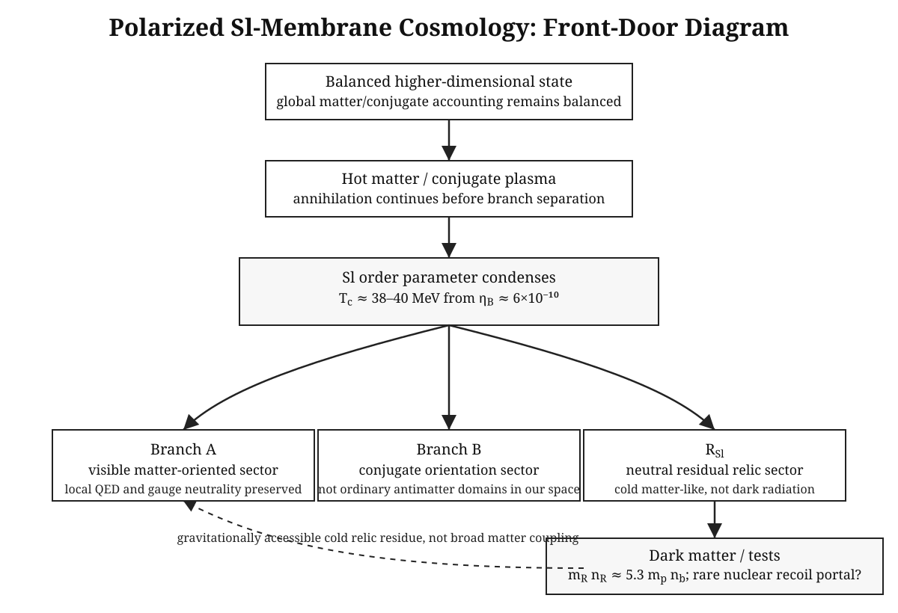

# Polarized Sl-Membrane Cosmology

**Independent theoretical-physics research program proposing a polarized-membrane cosmology with branch-separated baryon neutrality and defect-origin dark matter. Current status: conjectural, timestamped on Zenodo, seeking formal exclusion tests.**

## Start here

Read first: [Membrane Model — One-Page Entry Note](./one_page_summary.html)

Then read:

1. **Opus I** — conceptual membrane framework. DOI: `10.5281/zenodo.20991445`.
2. **Opus II** — Sl membrane, universal orientation sorting. DOI: `10.5281/zenodo.20991835`.
3. **Opus III** — universal pre-particle matter orientation and 40 MeV clarification. DOI: `10.5281/zenodo.21312037`.
4. **Conjecture I** — relic-statistics constraint and possible xenon recoil signature class.

Repository files:

- [GitHub repository](https://github.com/vslobody/polarized-sl-membrane)
- [One-page note source](https://github.com/vslobody/polarized-sl-membrane/blob/main/docs/one_page_summary.md)
- [Papers folder](https://github.com/vslobody/polarized-sl-membrane/tree/main/papers)
- [Conjecture I PDF](https://github.com/vslobody/polarized-sl-membrane/blob/main/notes/conjecture_i_sl_membrane_relics.pdf)

## Model in one diagram

## Why this is not a claim of discovery

The model is not claimed to be correct. The goal is to make it precise enough to test. The strongest current targets are relic density, BBN/CMB consistency, `N_eff`, neutron-star constraints, direct detection, and whether the relic-statistics number `kappa_R = n_R/n_b` can be derived.

## Hostile review request

I am looking for the fastest way to kill this model. If the framework fails, it should fail cleanly against a calculation or observation. The most useful criticism is one that identifies the shortest route to exclusion.
